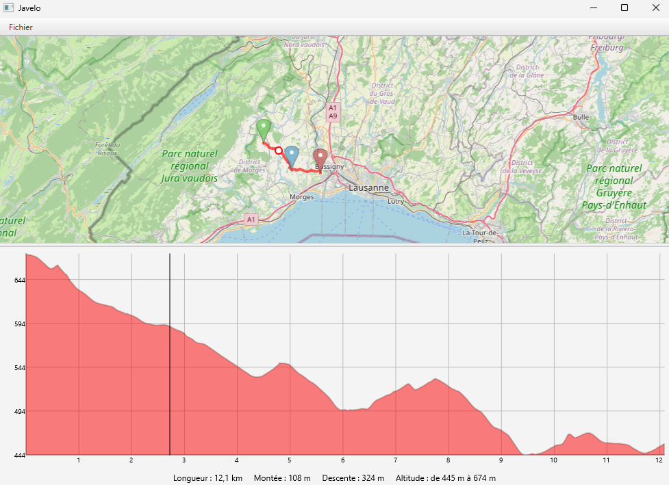

# JaVelo 🚴‍♂️🗺️
[](https://creativecommons.org/licenses/by-nc/4.0/)

This repository shares the project JaVelo part of Porject Oriented Programming course "CS-108" at EPFL, Bachelor course in team of 2.

## Overview
**JaVelo** is a robust desktop application designed to compute and visualize optimal bicycle routes across Switzerland. Developed as part of the rigorous EPFL CS-108 curriculum, this project features an interactive map, dynamic routing algorithms, and real-time elevation profile generation. It handles complex data parsing (OpenStreetMap), spatial coordinate projections, and graph-based pathfinding to deliver a seamless user experience.

Program example functionning:


## Key Features
* **Interactive Map Visualization:** Responsive map interface supporting panning, zooming, and dynamic tile loading (OSM).
* **Smart Route Computation:** Uses graph algorithms to calculate optimal paths based on distance, elevation gradients, and road suitability for bicycles.
* **Dynamic Elevation Profile:** Generates and renders a real-time, interactive altitude graph corresponding to the chosen route.
* **Waypoints Management:** Users can seamlessly add, move, or remove routing waypoints directly on the map.
* **GPX Export:** Allows users to export their generated itineraries into the standard `.gpx` format for use on physical GPS devices.
* **Custom Coordinate Systems:** Implements precise mathematical conversions between the Swiss coordinate system (CH1903) and Web Mercator.

## Tech Stack
* **Language:** Java
* **UI Framework:** JavaFX
* **Architecture:** Model-View-Controller (MVC) pattern, Observer pattern via JavaFX Properties
* **Testing:** JUnit 5

## Repository Structure
The codebase is heavily modularized to separate data management, algorithmic logic, and user interface:

```text
src/ch.epfl.javelo/
├── data/         # Graph representation of the Swiss road network (Nodes, Edges, Attributes)
├── gui/          # JavaFX controllers and UI components (AnnotatedMap, RouteManager, UI caching)
├── projection/   # Mathematical models for coordinate transformations (CH1903 / WebMercator)
├── routing/      # Core pathfinding algorithms, cost functions, and elevation computation
└── test/         # Comprehensive unit testing suite
